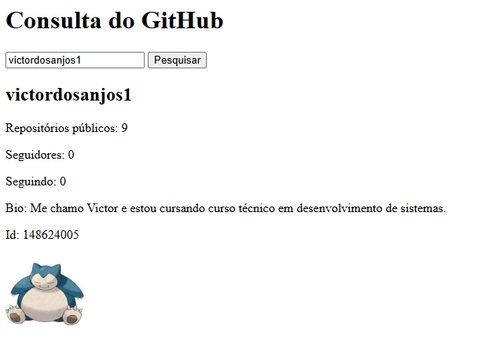
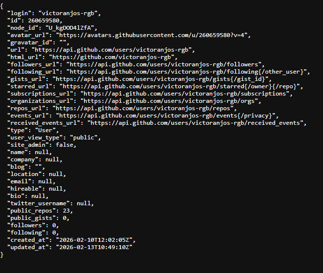

# Pesquisa sobre implementação de API

Feito por: Alexandre Zanoni e Victor dos Anjos

Turma: Ds24/M6

**Qual API que você usou?** A gente utilizou a API do GitHub. [api.github.com/users](https://api.github.com/users/)

**O que ela devolve?** Você pesquisa o nome de usuário da pessoa e ele te mostra o nome de usuário da pessoa, quantos seguidores você tem, quantas pessoas você segue e mostra sua foto de perfil do GitHub, mostra sua Bio do Github e seu Id.

###### O endereço que você chamou? [api.github.com/users/victoranjos-rgb](https://api.github.com/users/victoranjos-rgb)

**Como rodar:** Basta você abrir o arquivo index.html no seu navegador e pronto, o site já vai estar funcionando.

**Print da tela funcionando:**

**Uma dificuldade que você teve:** eu estava com dificuldade de descobrir algumas informações dos usuário e com esse site basta eu pesqusar o nome de usuário que ele já me dá tudo que eu preciso.

**Print de como fica quando pesquisa a url no navegador:**

